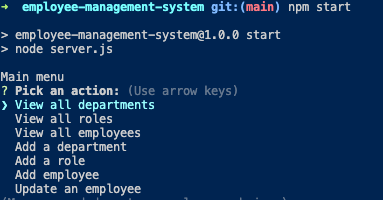

# Employee Management System
  
  ## Description
  
  CLI that allows managers to keep track of their employees, roles, and departments

  - [Installation](#install)
  - [Usage](#usage)
  
  
  <a name="install"></a>
  ## Installation
  
  ```bash 
  npm install
  ```
  
  <a name="usage"></a>
  ## Usage
  
  ```bash 
  npm start
  ```
  

  
  
  Video Link: https://watch.screencastify.com/v/2cjfW5YhcKqWTGraULzR
  
  
  Github: cnhnguyen59 (https://github.com/cnhnguyen59)
  Email: cnhnguyen59@gmail.com

  